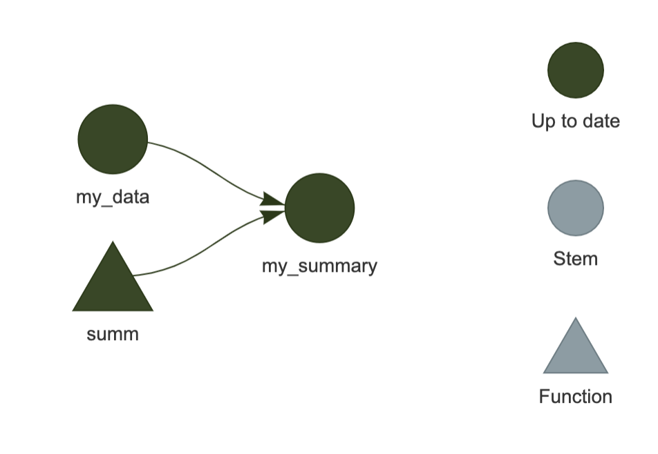

:::::::::::::::::::::::::::::::::::::: questions 

- What happens if we re-run a workflow?
- How does `targets` know what steps to re-run?
- How can we inspect the state of the workflow?

::::::::::::::::::::::::::::::::::::::::::::::::

::::::::::::::::::::::::::::::::::::: objectives

- Explain how `targets` helps increase efficiency
- Be able to inspect a workflow to see what parts are outdated

::::::::::::::::::::::::::::::::::::::::::::::::

::::::::::::::::::::::::::::::::::::: {.instructor}

Episode summary: Demonstrate typical cycle of running `targets`: make, inspect, adjust, make...

:::::::::::::::::::::::::::::::::::::

```{r}
#| label: setup
#| echo: FALSE
#| message: FALSE
#| warning: FALSE
library(targets)
library(visNetwork)
source("https://raw.githubusercontent.com/joelnitta/targets-workshop/main/episodes/files/functions.R?token=$(date%20+%s)") # nolint
```

## Re-running the workflow

One of the features of `targets` is that it maximizes efficiency by only running the parts of the workflow that need to be run.

This is easiest to understand by trying it yourself. Let's try running the workflow again:

```{r}
#| label: targets-run-show
#| eval: FALSE
tar_make()
```

```{r}
#| label: targets-run-hide
#| echo: FALSE
# Each tar_script is fresh, so need to run once to catch up to learners
tar_dir({
  write_example_plan(1)
  tar_make(reporter = "silent")
  tar_make()
})
```

Remember how the first time we ran the pipeline, `targets` printed out a list of each target as it was being built?

This time, it tells us it is skipping those targets; they have already been built, so there's no need to run that code again.

Remember, the fastest code is the code you don't have to run!

## Re-running the workflow after modification

What happens when we change one part of the workflow then run it again?

Say that we decide the species names should be shorter.
Right now they include the common name and the scientific name, but we really only need the first part of the common name to distinguish them.

Edit `_targets.R` so that the `clean_penguin_data()` function looks like this:

```{r}
#| label: new-func
#| eval: FALSE
clean_penguin_data <- function(penguins_data_raw) {
  penguins_data_raw |>
    select(
      species = Species,
      bill_length_mm = `Culmen Length (mm)`,
      bill_depth_mm = `Culmen Depth (mm)`
    ) |>
    drop_na() |>
    # Split "species" apart on spaces, and only keep the first word
    separate(species, into = "species", extra = "drop")
}
```

Then run it again.

```{r}
#| label: targets-run-show-2
#| eval: FALSE
tar_make()
```

```{r}
#| label: targets-run-hide-2
#| echo: FALSE
tar_dir({
  # Original workflow
  write_example_plan(1)
  # Run it silently
  tar_make(reporter = "silent")
  # New workflow
  write_example_plan(2)
  # Run it again
  tar_make()
})
```

What happened?

This time, it skipped `penguins_csv_file` and `penguins_data_raw` and only ran `penguins_data`.

Of course, since our example workflow is so short we don't even notice the amount of time saved.
But imagine using this in a series of computationally intensive analysis steps.
The ability to automatically skip steps results in a massive increase in efficiency.

::::::::::::::::::::::::::::::::::::: challenge

## Challenge 1: Inspect the output

How can you inspect the contents of `penguins_data`?

:::::::::::::::::::::::::::::::::: solution

With `tar_read(penguins_data`) or by running `tar_load(penguins_data)` followed by `penguins_data`.

::::::::::::::::::::::::::::::::::::::::::::

:::::::::::::::::::::::::::::::::::::::::::::::

## Under the hood

How does `targets` keep track of which targets are up-to-date vs. outdated?

For each target in the workflow (items in the list at the end of the `_targets.R` file) and any custom functions used in the workflow, `targets` calculates a **hash value**, or unique combination of letters and digits that represents an object in the computer's memory.
You can think of the hash value (or "hash" for short) as **a unique fingerprint** for a target or function.

The first time your run `tar_make()`, `targets` calculates the hashes for each target and function as it runs the code and stores them in the targets cache (the `_targets` folder).
Then, for each subsequent call of `tar_make()`, it calculates the hashes again and compares them to the stored values.
It detects which have changed, and this is how it knows which targets are out of date.

:::::::::::::::::::::::::::::::::::::::: callout

## Where the hashes live

If you are curious about what the hashes look like, you can see them in the file `_targets/meta/meta`, but **do not edit this file by hand**---that would ruin your workflow!

::::::::::::::::::::::::::::::::::::::::

This information is used in combination with the dependency relationships (in other words, how each target depends on the others) to re-run the workflow in the most efficient way possible: code is only run for targets that need to be re-built, and others are skipped.

## Visualizing the workflow

Typically, you will be making edits to various places in your code, adding new targets, and running the workflow periodically.
It is good to be able to visualize the state of the workflow.

This can be done with `tar_visnetwork()`

```{r}
#| label: targets-run-show-3
#| eval: FALSE
tar_visnetwork()
```

```{r}
#| label: targets-run-hide-3
#| echo: FALSE
#| results: "asis"
#| eval: FALSE

# TODO: Change #| eval to TRUE when
# https://github.com/carpentries/sandpaper/issues/443
# is resolved

tar_dir({
  # New workflow
  write_example_plan(2)
  # Run it
  tar_make(reporter = "silent")
  # Run it again
  tar_make(reporter = "silent")
  tar_visnetwork()
})
```

{alt="Visualization of the targets worklow, showing 'penguins_data' connected by lines to 'penguins_data_raw', 'penguins_csv_file' and 'clean_penguin_data'"}

You should see the network show up in the plot area of RStudio.

It is an HTML widget, so you can zoom in and out (this isn't important for the current example since it is so small, but is useful for larger, "real-life" workflows).

Here, we see that all of the targets are dark green, indicating that they are up-to-date and would be skipped if we were to run the workflow again.

::::::::::::::::::::::::::::::::::::: prereq 

## Installing visNetwork

You may encounter an error message `The package "visNetwork" is required.`

In this case, install it first with `install.packages("visNetwork")`.

::::::::::::::::::::::::::::::::::::::::::::::::

::::::::::::::::::::::::::::::::::::: challenge

## Challenge 2: What else can the visualization tell us?

Modify the workflow in `_targets.R`, then run `tar_visnetwork()` again **without** running `tar_make()`.
What color indicates that a target is out of date?

:::::::::::::::::::::::::::::::::: solution

Light blue indicates the target is out of date.

Depending on how you modified the code, any or all of the targets may now be light blue.

::::::::::::::::::::::::::::::::::::::::::::

:::::::::::::::::::::::::::::::::::::::::::::::

::::::::::::::::::::::::::::::::::::: callout

## 'Outdated' does not always mean 'will be run'

Just because a target appears as light blue (is "outdated") in the network visualization, this does not guarantee that it will be re-built during the next run. Rather, it means that **at least of one the targets that it depends on has changed**.

For example, if the workflow state looked like this:

`A -> B* -> C -> D`

where the `*` indicates that `B` has changed compared to the last time the workflow was run, the network visualization will show `B`, `C`, and `D` all as light blue.

But if re-running the workflow results in the exact same value for `C` as before, `D` will not be re-run (will be "skipped").

Most of the time, a single change will cascade to the rest of the downstream targets and cause them to be re-built, but this is not always the case. `targets` has no way of knowing ahead of time what the actual output will be, so it cannot provide a network visualization that completely predicts the future!

:::::::::::::::::::::::::::::::::::::::::::::::

## Other ways to check workflow status

The visualization is very useful, but sometimes you may be working on a server that doesn't provide graphical output, or you just want a quick textual summary of the workflow.
There are some other useful functions that can do that.

`tar_outdated()` lists only the outdated targets; that is, targets that will be built during the next run, or depend on such a target.
If everything is up to date, it will return a zero-length character vector (`character(0)`).

`tar_progress()` shows the current status of the workflow as a dataframe.
You may find it helpful to further manipulate the dataframe to obtain useful summaries of the workflow, for example using `dplyr` (such data manipulation is beyond the scope of this lesson but the instructor may demonstrate its use).

```{r}
#| label: targets-outdated-show
#| eval: FALSE
tar_outdated()
```

```{r}
#| label: targets-outdated-hide
#| echo: FALSE
tar_dir({
  # New workflow
  write_example_plan(2)
  # Run it
  tar_make(reporter = "silent")
  # Run it again
  tar_make(reporter = "silent")
  tar_outdated()
})
```

```{r}
#| label: targets-progress-show
#| eval: FALSE
tar_progress()
```

```{r}
#| label: targets-progress-hide
#| echo: FALSE
tar_dir({
  # New workflow
  write_example_plan(2)
  # Run it
  tar_make(reporter = "silent")
  # Run it again
  tar_make(reporter = "silent")
  tar_progress()
})
```

## Granular control of targets

It is possible to only make a particular target instead of running the entire workflow.

To do this, type the name of the target you wish to build after `tar_make()` (note that any targets required by the one you specify will also be built).
For example, `tar_make(penguins_data_raw)` would **only** build `penguins_data_raw`, not `penguins_data`.

Furthermore, if you want to manually "reset" a target and make it appear out-of-date, you can do so with `tar_invalidate()`. This means that target (and any that depend on it) will be re-run next time.

Let's give this a try. Remember that our pipeline is currently up to date, so `tar_make()` will skip everything:

```{r}
#| label: targets-progress-show-2
#| eval: FALSE
tar_make()
```

```{r}
#| label: targets-progress-hide-2
#| echo: FALSE
tar_dir({
  # New workflow
  write_example_plan(2)
  # Run it
  tar_make(reporter = "silent")
  # Run it again
  tar_make()
})
```

Let's invalidate `penguins_data` and run it again:

```{r}
#| label: targets-progress-show-3
#| eval: FALSE
tar_invalidate(penguins_data)
tar_make()
```

```{r}
#| label: targets-progress-hide-3
#| echo: FALSE
tar_dir({
  # New workflow
  write_example_plan(2)
  # Run it
  tar_make(reporter = "silent")
  tar_invalidate(penguins_data)
  # Run it again
  tar_make()
})
```

If you want to reset **everything** and start fresh, you can use `tar_invalidate(everything())` (`tar_invalidate()` [accepts `tidyselect` expressions](https://docs.ropensci.org/targets/reference/tar_invalidate.html) to specify target names).

**Caution should be exercised** when using granular methods like this, though, since you may end up with your workflow in an unexpected state. The surest way to maintain an up-to-date workflow is to run `tar_make()` frequently.

## How this all works in practice

In practice, you will likely be switching between running the workflow with `tar_make()`, loading the targets you built with `tar_load()`, and editing your custom functions by running code in an interactive R session. It takes some time to get used to it, but soon you will feel that your code isn't "real" until it is embedded in a `targets` workflow.

::::::::::::::::::::::::::::::::::::: keypoints 

- `targets` only runs the steps that have been affected by a change to the code
- `tar_visnetwork()` shows the current state of the workflow as a network
- `tar_progress()` shows the current state of the workflow as a data frame
- `tar_outdated()` lists outdated targets
- `tar_invalidate()` can be used to invalidate (re-run) specific targets

::::::::::::::::::::::::::::::::::::::::::::::::
