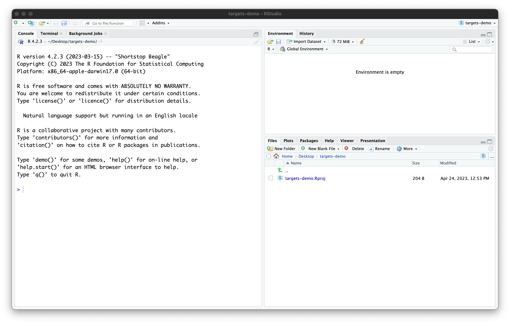

:::::::::::::::::::::::::::::::::::::: questions 

- 分析を整理するためのベストプラクティスは何ですか？
- `_targets.R` ファイルは何のためのものですか？
- `_targets.R` ファイルの内容は何ですか？
- ワークフローを実行するにはどうしますか？ 

::::::::::::::::::::::::::::::::::::::::::::::::

::::::::::::::::::::::::::::::::::::: objectives

- RStudioでプロジェクトを作成する
- `_targets.R` ファイルの目的を説明する
- 基本的な `_targets.R` ファイルを書く
- `_targets.R` ファイルを使用してワークフローを実行する

::::::::::::::::::::::::::::::::::::::::::::::::

::::::::::::::::::::::::::::::::::::: {.instructor}

エピソードの概要: 非常にシンプルなワークフローを書いて、初めて実際に手を動かしてみる機会

:::::::::::::::::::::::::::::::::::::

```{r}
#| label: setup
#| echo: FALSE
#| message: FALSE
#| warning: FALSE
library(targets)
source("files/lesson_functions.R")
```

## プロジェクトの作成

### プロジェクトについて

`targets` は分析を整理するために「プロジェクト」の概念を使用します。特定のプロジェクトに必要なすべてのファイルを1つのフォルダ、プロジェクトフォルダにまとめます。

プロジェクトフォルダには、データ、コード、結果用のフォルダなど、整理のための追加のサブフォルダがあります。

プロジェクトを使用することで、他の作業に時間を費やした後に分析に戻った際に、簡単に再び方向付けることができます。

もし一度に1つの作業のみを完了させる場合は問題になりませんが、実際にはほとんどの場合そうではありません。

他の作業をした後にプロジェクトに戻るときに、何をしていたかを覚えておくのは難しいです（「コンテキストスイッチング」と呼ばれる現象）。

標準化された整理システムを使用することで、混乱や時間の浪費を減らすことができます。つまり、再現性を高めることになります！

このワークショップでは、プロジェクトの整理概念ともうまく連携する RStudio を使用します。

### RStudioでプロジェクトを作成する

RStudioを使用して新しいプロジェクトを開始しましょう。

「ファイル」をクリックし、「新しいプロジェクト」を選択します。

これにより、新しいプロジェクトウィザードが開き、プロジェクトの設定を手助けする一連のメニューが表示されます。

{alt="RStudioの新しいプロジェクトウィザードメニューのスクリーンショット"}

ウィザードで最初のオプション「新しいディレクトリ」をクリックします。これは、新しいプロジェクトをゼロから作成するためです。

次のメニューで「新しいプロジェクト」をクリックします。

「ディレクトリ名」には、プロジェクトの目的を思い出しやすい名前を入力します。例えば「targets-demo」（ファイルやフォルダの命名のベストプラクティスに従ってください）。

「プロジェクトをサブディレクトリとして作成する...」の下で、「参照」ボタンをクリックしてプロジェクトを配置するディレクトリを選択します。

プロジェクトを簡単に見つけられるように、デスクトップに配置することをお勧めします。

「Gitリポジトリを作成」と「このプロジェクトで renv を使用する」はチェックを外したままにできますが、これらは再現性を向上させる優れたツールです。もしまだであれば、将来的に学習して使用することを検討してください。

これらは後からでも有効にできるため、すぐに使用しようと心配する必要はありません。

これらの手順を進めると、RStudioのセッションは次のようになります：

{alt="新しく作成された 'targets-demo' プロジェクトが開かれ、1つのファイル 'targets-demo.Rproj' を含むRStudioのスクリーンショット"}

プロジェクトには現在、RStudioによって作成された1つのファイル `targets-demo.Rproj` が含まれています。このファイルを手動で編集しないでください。その目的は、RStudioにこのフォルダがプロジェクトフォルダであることを伝え、いくつかのRStudio設定を保存することです（バージョン管理ソフトウェアを使用している場合は、このファイルをコミットしても構いません）。また、ファイルエクスプローラーで `.Rproj` ファイルをダブルクリックすることでプロジェクトを開くことができます（RStudioを終了してからファイルブラウザでデスクトップに移動し、「targets-demo」フォルダを開いて `targets-demo.Rproj` をダブルクリックして試してください）。

さて、プロジェクトが設定されたので、`targets` の使用を開始する準備ができました！

## `_targets.R` ファイルの作成

すべての `targets` プロジェクトには、メインプロジェクトフォルダ（「プロジェクトルート」）にある特別なファイル `_targets.R` を含める必要があります。

`_targets.R` ファイルにはワークフローの仕様が含まれており、Rに分析を実行する指示が記述されています。これはレシピのようなものです。

`_targets.R` ファイルを使用することで、特定のスクリプトを特定の順序で実行することを覚えておく必要がなくなります。

代わりに、Rがそれを自動的に実行してくれます（再現性が向上します）！

### `_targets.R` ファイルの構成

これから `_targets.R` ファイルの作成を開始します。幸い、`targets` にはこれを手助けする関数が用意されています。

Rコンソールで、まず `library(targets)` で `targets` パッケージを読み込み、次に `tar_script()` コマンドを実行します。

```{r}
#| label: start-targets-show
#| eval: FALSE
library(targets)
tar_script()
```

コンソールでは何も起こりませんが、ファイルビューアに新しいファイル `_targets.R` が表示されます。ファイルメニューを使用するか、クリックして開いてください。

このデフォルトの `_targets.R` ファイルには3つの主要な部分が含まれています：

- `library()` を使用したパッケージの読み込み
- `function()` を使用したカスタム関数の定義
- `list()` を使用したリストの定義

最後の部分であるリストは、`_targets.R` ファイルの中で最も重要な部分です。

ワークフローのステップを定義します。

`_targets.R` ファイルは常にこのリストで終わらなければなりません。

さらに、リスト内の各項目は `tar_target()` 関数の呼び出しです。

`tar_target()` の最初の引数はビルドするターゲットの名前で、2番目の引数はそれをビルドするために使用するコマンドです。

ターゲットの名前は**引用符なし**、つまり、引用符で囲まれていないことに注意してください。

## 例示分析を実行するための `_targets.R` ファイルの設定

### 背景: `targets` を使用しないバージョン

このテンプレートを使用して、ペンギンのくちばしの形状の分析を構築し始めます。

しかしまず、使用する関数やパッケージに慣れるために、`targets` を使用せずに「通常の」Rスクリプトでコードを実行してみましょう。

データを取得するために `palmerpenguins` Rパッケージを使用していることを思い出してください。

このパッケージには実際にデータセットの2つのバリエーションが含まれています。1つは生データを含む外部CSVファイルで、もう1つはRに読み込まれたクリーンなデータです。

実際のところ、生データは外部に保存されていることが多いため、**生のペンギンデータ** を分析の出発点として使用しましょう。

`palmerpenguins` の `path_to_file()` 関数は、生データCSVファイルへのパスを提供します（これは、パッケージをインストールしたときにコンピュータにダウンロードされた `palmerpenguins` Rパッケージのソースコード内にあります）。

```{r}
#| label: normal-r-path
library(palmerpenguins)

# Get path to CSV file
penguins_csv_file <- path_to_file("penguins_raw.csv")

penguins_csv_file
```

データの読み込みと操作には、`tidyverse` パッケージ群を使用します。

今は `tidyverse` の使用方法のすべての詳細をカバーする時間がありませんが、詳細を学びたい場合は、["tidyverse を使用したデータの操作、分析、およびエクスポート" レッスン](https://datacarpentry.org/R-ecology-lesson/03-dplyr.html) を参照してください。

`read_csv()` を使用してデータを読み込みましょう。

```{r}
#| label: normal-r-load-show
#| eval: false
library(tidyverse)

# Read CSV file into R
penguins_data_raw <- read_csv(penguins_csv_file)

penguins_data_raw
```

```{r}
#| label: normal-r-load-hide
#| echo: false
suppressPackageStartupMessages(library(tidyverse))

# Read CSV file into R
penguins_data_raw <- read_csv(penguins_csv_file)

penguins_data_raw
```

生データにはスペースを含む扱いにくい列名があり（これらはタイプミスしやすくコードのミスにつながりやすい）、必要なものよりもはるかに多くの列があります。

この分析の目的では、種名、くちばしの長さ、くちばしの深さのみが必要です。

生データでは、「culmen」というやや技術的な用語がくちばしを指すために使用されています。


下流の分析で使用しやすくするためにデータを整理しましょう。

後で一部の関数でエラーを引き起こす可能性があるため、欠損データを含む行も削除します。

```{r}
#| label: normal-r-clean

# Clean up raw data
penguins_data <- penguins_data_raw |>
  # Rename columns for easier typing and
  # subset to only the columns needed for analysis
  select(
    species = Species,
    bill_length_mm = `Culmen Length (mm)`,
    bill_depth_mm = `Culmen Depth (mm)`
  ) |>
  # Delete rows with missing data
  remove_missing(na.rm = TRUE)

penguins_data
```

これで良くなりました！

### `targets` バージョン

`targets` を使用するとどのようになりますか？

最大の違いは、ワークフローの各ステップを最後のリストに**追加する必要がある**ことです。

データクリーニングステップのためにカスタム関数も定義します。

これは、最後のターゲットのリストが**分析の高レベルな要約のように見えるべき**だからです。

ターゲットを定義するときに長いコードの塊を避けたいです。代わりに、そのコードをカスタム関数に入れます。

他のステップ（ファイルパスの設定とデータの読み込み）はそれぞれ1つの関数呼び出しだけなので、それらを独自のカスタム関数に入れる意味はあまりありません。

最後に、ワークフローの各ステップは `tar_target()` 関数で定義されます。

```{r}
#| label = "targets-show-workflow",
#| eval = FALSE,
#| code = readLines("files/plans/plan_1.R")[2:21]
```

`read_csv()` で `show_col_types = FALSE` に設定したのは、先ほどのコードから列の型がデフォルトで正しく設定されている（種には文字列、くちばしの長さと深さには数値）ことがわかっているためです。したがって、通常発生する警告を表示する必要はありません。

## ワークフローの実行

ワークフローができたので、`tar_make()` 関数を使用して実行できます。

それを実行してみてください。次のようなものが表示されるはずです：

```{r}
#| label: targets-run
#| eval: true
#| echo: [3]
pushd(make_tempdir())
write_example_plan("plan_1.R")
tar_make()
popd()
```

おめでとうございます、`targets` を使って最初のワークフローを実行しました！

::::::::::::::::::::::::::::::: keypoints 

- プロジェクトは分析を整理しておくのに役立ち、後で簡単に再実行できます
- RStudioのプロジェクトウィザードを使用してプロジェクトを作成する
- `_targets.R` ファイルはすべての `targets` プロジェクトに含める必要がある特別なファイルであり、ワークフローを定義します
- `tar_script()` を使用してデフォルトの `_targets.R` ファイルを作成する
- `tar_make()` を使用してワークフローを実行する

:::::::::::::::::::::::::::::::::
