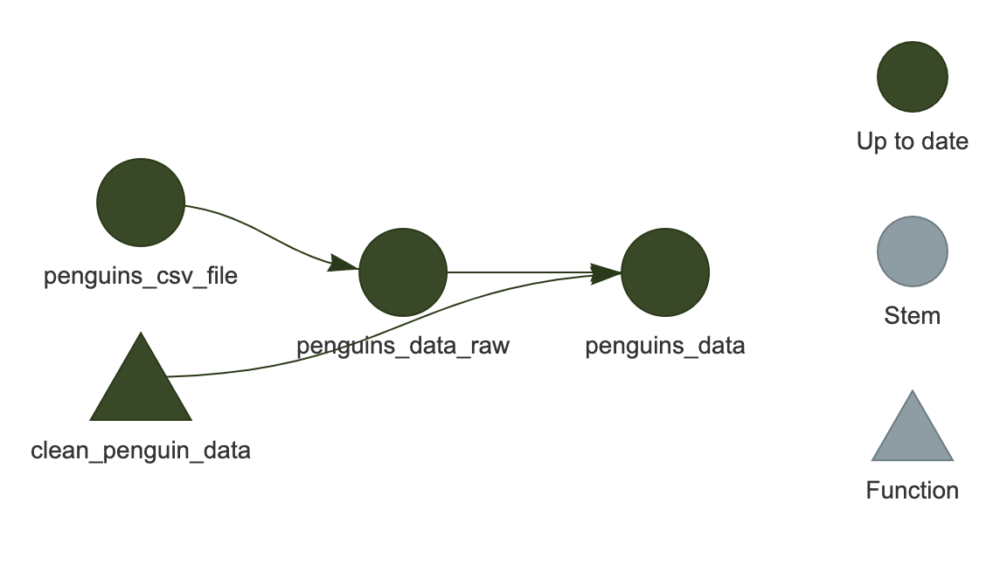

:::::::::::::::::::::::::::::::::::::: questions 

- ワークフローを再実行するとどうなりますか？
- `targets` はどのようにして再実行すべきステップを認識しますか？
- ワークフローの状態をどのように検査できますか？

::::::::::::::::::::::::::::::::::::::::::::::::

::::::::::::::::::::::::::::::::::::: objectives

- `targets` が効率性を向上させる方法を説明する
- ワークフローの古くなった部分を確認する方法を習得する

::::::::::::::::::::::::::::::::::::::::::::::::

::::::::::::::::::::::::::::::::::::: {.instructor}

エピソードの概要: `targets` の典型的なサイクルである make、inspect、adjust、make を実演する

:::::::::::::::::::::::::::::::::::::

```{r}
#| label: setup
#| echo: FALSE
#| message: FALSE
#| warning: FALSE
library(targets)
library(visNetwork)
source("files/lesson_functions.R")
```

## ワークフローの再実行

`targets` の特徴の一つは、実行が必要なワークフローの部分のみを実行することで効率性を最大化することです。

これは実際に試してみると理解しやすいです。ワークフローをもう一度実行してみましょう：

```{r}
#| label: targets-run
#| echo: [5]
# Each tar_script is fresh, so need to run once to catch up to learners
pushd(make_tempdir())
write_example_plan("plan_1.R")
tar_make(reporter = "silent")
tar_make()
popd()
```

最初にパイプラインを実行したとき、`targets` がビルドされている各ターゲットのリストを出力したことを覚えていますか？

今回は、それらのターゲットをスキップしていると教えてくれます。すでにビルドされているため、同じコードを再度実行する必要がないからです。

覚えておいてください、最速のコードは実行しなくて済むコードです！

## 変更後のワークフローの再実行

ワークフローの一部を変更してから再度実行するとどうなりますか？

例えば、種名を短くすることに決めたとしましょう。
現在は一般名と学名が含まれていますが、区別するために一般名の最初の部分のみが必要です。

`_targets.R` を編集して、`clean_penguin_data()` 関数を以下のようにします：

```{r}
#| label: new-func
#| eval: FALSE
#| file: files/tar_functions/clean_penguin_data.R
```

そして、再度実行します。

```{r}
#| label: targets-run-2
#| echo: [6]
plan_2_dir <- make_tempdir()
pushd(plan_2_dir)
write_example_plan("plan_1.R")
tar_make(reporter = "silent")
write_example_plan("plan_2.R")
tar_make()
popd()
```

何が起こったでしょうか？

今回は、`penguins_csv_file` と `penguins_data_raw` をスキップし、`penguins_data` のみを実行しました。

もちろん、私たちの例示ワークフローは非常に短いため、節約された時間を感じ取ることはほとんどありません。
しかし、計算集約的な一連の分析ステップでこれを使用することを想像してみてください。
ステップを自動的にスキップする能力は、効率性を大幅に向上させます。

::::::::::::::::::::::::::::::::::::: challenge

## チャレンジ 1: 出力を検査する

`penguins_data` の内容をどのように検査できますか？

:::::::::::::::::::::::::::::::::: solution

`tar_read(penguins_data)` を使用するか、`tar_load(penguins_data)` を実行した後に `penguins_data` を実行します。

::::::::::::::::::::::::::::::::::::::::::::

:::::::::::::::::::::::::::::::::::::::::::::::

## 内部動作

`targets` は、どのターゲットが最新であり、どれが古くなっているかをどのように追跡していますか？

ワークフロー内の各ターゲット（`_targets.R` ファイルの最後のリスト内の項目）およびワークフローで使用されるカスタム関数ごとに、`targets` は**ハッシュ値**、つまりコンピュータのメモリ内のオブジェクトを表す一意の文字と数字の組み合わせを計算します。
ハッシュ値（略して「ハッシュ」）をターゲットや関数の**一意の指紋**と考えることができます。

最初に `tar_make()` を実行すると、`targets` はコードを実行しながら各ターゲットと関数のハッシュを計算し、それらを targets キャッシュ（`_targets` フォルダ）に保存します。
その後、`tar_make()` を呼び出すたびに、再度ハッシュを計算し、保存された値と比較します。
どれが変更されたかを検出し、これがどのターゲットが古くなっているかを知る方法です。

:::::::::::::::::::::::::::::::::::::::: callout

## ハッシュが存在する場所

ハッシュがどのように見えるか気になる場合は、ファイル `_targets/meta/meta` に見ることができますが、**このファイルを手動で編集しないでください**---ワークフローが壊れてしまいます！

::::::::::::::::::::::::::::::::::::::::

この情報は、依存関係の関係（つまり、各ターゲットが他のターゲットにどのように依存しているか）と組み合わせて使用され、ワークフローを可能な限り効率的に再実行します：再構築が必要なターゲットに対してのみコードが実行され、他のターゲットはスキップされます。

## ワークフローの可視化

通常、コードのさまざまな場所を編集し、新しいターゲットを追加し、定期的にワークフローを実行することになります。
ワークフローの状態を可視化できることは良いことです。

これは `tar_visnetwork()` を使用して行うことができます。

```{r}
#| label: targets-run-hide-3
#| echo: [5]
#| results: "asis"
#| eval: FALSE
# TODO: Change #| eval to TRUE when
# https://github.com/carpentries/sandpaper/issues/443
# is resolved
pushd(plan_2_dir)
tar_visnetwork()
popd()
```

{alt="ワークフローの可視化、'penguins_data' が 'penguins_data_raw', 'penguins_csv_file' および 'clean_penguin_data' に接続されている様子"}

ネットワークが RStudio のプロット領域に表示されるはずです。

これは HTML ウィジェットなので、ズームインやズームアウトが可能です（現在の例では非常に小さいため重要ではありませんが、より大きな「実際の」ワークフローでは役立ちます）。

ここでは、すべてのターゲットが濃い緑色で表示されており、次にワークフローを実行したときにスキップされることを示しています。

::::::::::::::::::::::::::::::::::::: prereq 

## visNetwork のインストール

`The package "visNetwork" is required.` というエラーメッセージが表示される場合があります。

この場合、まず `install.packages("visNetwork")` を実行してインストールしてください。

::::::::::::::::::::::::::::::::::::::::::::::::

::::::::::::::::::::::::::::::::::::: challenge

## チャレンジ 2: 可視化は他に何を教えてくれますか？

`_targets.R` でワークフローを変更し、`tar_make()` を実行せずに再度 `tar_visnetwork()` を実行してください。
ターゲットが古くなっていることを示す色は何ですか？

:::::::::::::::::::::::::::::::::: solution

薄い青色がターゲットが古くなっていることを示します。

コードをどのように変更したかによりますが、ターゲットのいくつかまたはすべてが薄い青色になる場合があります。

::::::::::::::::::::::::::::::::::::::::::::

:::::::::::::::::::::::::::::::::::::::::::::::

::::::::::::::::::::::::::::::::::::: callout

## '古くなっている' は必ずしも '実行される' ことを意味しない

ターゲットがネットワークの可視化で薄い青色（「古くなっている」）として表示されているからといって、次回の実行時に必ず再構築されるわけではありません。これは、**依存しているターゲットの少なくとも一つが変更されたことを意味します**。

例えば、ワークフローの状態が以下のようになっているとします：

`A -> B* -> C -> D`

ここで `*` は `B` が最後にワークフローを実行したときと比較して変更されたことを示します。ネットワークの可視化では `B`, `C`, `D` がすべて薄い青色で表示されます。

しかし、ワークフローを再実行して `C` が以前と全く同じ値になる場合、`D` は再実行されず（「スキップ」されます）。

ほとんどの場合、単一の変更が下流のターゲット全体に影響を及ぼし、再構築を引き起こしますが、必ずしもそうではありません。`targets` は事前に実際の出力がどうなるかを知る方法がないため、将来を完全に予測するネットワーク可視化を提供することはできません！

:::::::::::::::::::::::::::::::::::::::::::::::

## ワークフローの状態を確認する他の方法

可視化は非常に便利ですが、時にはグラフィカルな出力を提供しないサーバー上で作業している場合や、ワークフローの迅速なテキストサマリーを望む場合があります。
それを行うための他の有用な関数があります。

`tar_outdated()` は古くなったターゲットのみをリストします。つまり、次回の実行時にビルドされるターゲット、またはそのようなターゲットに依存するターゲットです。
すべてが最新の場合、ゼロ長の文字ベクトル (`character(0)`) を返します。

```{r}
#| label: targets-outdated
#| echo: [2]
pushd(plan_2_dir)
tar_outdated()
popd()
```

`tar_progress()` はワークフローの現在の状態をデータフレームとして表示します。
ワークフローの有用なサマリーを取得するためにデータフレームをさらに操作することが役立つ場合があります。例えば、`dplyr` を使用するなど（このデータ操作はこのレッスンの範囲外ですが、インストラクターがその使用を示すかもしれません）。

```{r}
#| label: targets-progress
#| echo: [2]
pushd(plan_2_dir)
tar_progress()
popd()
```

## ターゲットの細かい制御

特定のターゲットのみをビルドし、ワークフロー全体を実行しないことが可能です。

これを行うには、`tar_make()` の後にビルドしたいターゲットの名前を入力します（指定したターゲットに必要な他のターゲットもビルドされることに注意してください）。
例えば、`tar_make(penguins_data_raw)` は `penguins_data_raw` のみをビルドし、`penguins_data` はビルドしません。

さらに、ターゲットを手動で「リセット」し、古くなったように見せるには、`tar_invalidate()` を使用できます。これは、次回の実行時にそのターゲット（およびそれに依存するターゲット）が再実行されることを意味します。

これを試してみましょう。現在、私たちのパイプラインは最新の状態なので、`tar_make()` はすべてをスキップします：

```{r}
#| label: targets-progress-show-2
#| eval: true
#| echo: [2]
pushd(plan_2_dir)
tar_make()
popd()
```

`penguins_data` を無効化し、再度実行してみましょう：

```{r}
#| label: targets-progress-show-3
#| eval: true
#| echo: [2, 3]
pushd(plan_2_dir)
tar_invalidate(penguins_data)
tar_make()
popd()
```

もしすべてをリセットして新たに開始したい場合は、`tar_invalidate(everything())` を使用して `_targets` フォルダ全体を削除することができます（`tar_invalidate()` はターゲット名を指定するために `tidyselect` 式を受け入れます）。
しかし、これはすべてを再実行する必要があることを意味するため、軽率に行わないでください！

## 実際の運用での動作

実際には、`tar_make()` を使用してワークフローを実行し、`tar_load()` を使用してビルドしたターゲットをロードし、インタラクティブな R セッションでコードを実行してカスタム関数を編集することを行き来することが多いでしょう。慣れるまで時間がかかりますが、すぐに `targets` ワークフローに組み込まれていないコードは「本物ではない」と感じるようになるでしょう。

::::::::::::::::::::::::::::::::::::: keypoints 

- `targets` はコードの変更に影響を受けたステップのみを実行します
- `tar_visnetwork()` はワークフローの現在の状態をネットワークとして表示します
- `tar_progress()` はワークフローの現在の状態をデータフレームとして表示します
- `tar_outdated()` は古くなったターゲットをリストします
- `tar_invalidate()` は特定のターゲットを無効化（再実行）するために使用できます

::::::::::::::::::::::::::::::::::::::::::::::::
